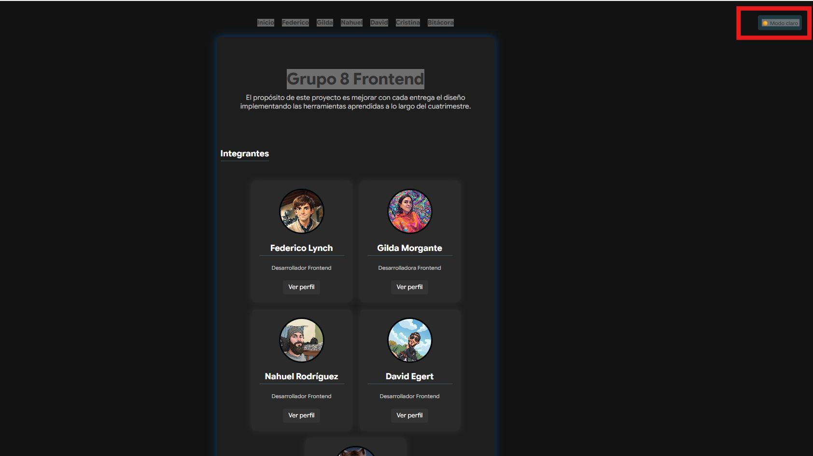

# TP1 Web Grupo 8

## Descripción
Este trabajo práctico se trata de la creación de una página web grupal utilizando HTML, CSS Y JavaScript.
Inlcuye una portada principal (Archivo Index) donde se puede visualizar el nombre de cada integrante del grupo. En dicha portada se ha implementado un estilo de fuente importada desde google-font, como tambien efectos de transición y de cambio de colores utilizando interactividad con JavaScript.
Cada integrante tiene una tarjeta vinculada con una imagen y un botón desde el cual se puede navegar a la página indivual del mismo donde se encontrará una breve descripción según lo solicitado en el tp y una interacción con JavaScript
Se han implementado buenas prácticas creando un archivo Index.html para la portada, un html para cada integrante, una carpeta denominada "img" para depositar las imágenes del proyecto, un archivo Css para definir estilos

## Integrantes
- Federico Lynch
- Gilda Morgante
- Nahuel Rodriguez 
- David Egert
- Maria Cristina Roma 

## Tecnologías utilizadas
- HTML
- CSS
- JavaScript

## Estructura del proyecto

El proyecto está organizado de la siguiente manera:

- **Raíz:** `index.html` y un HTML por cada integrante del equipo, más `bitacora.html`.
- **componentes/**: archivos reutilizables de `header.html` y `footer.html`.
- **css/**: hoja de estilos compartida `estilos.css`.
- **js/**: archivo `script.js` con las funciones de interacción.
- **img/**: imágenes del proyecto.
## Repositorio
https://github.com/LynchFede/tp1-web-grupo-8

## Guía de Estilos
-Paleta de colores utilizadas: 
- Se tomó como referencia la siguiente combinación: https://colorhunt.co/palette/313647435663a3b087fff8d4
Listado de códigos:
-Backround principal #0f2027, #203a43, #2c5364 (fondo principal) y #A3B087 (para contenedor de tarjetas)
-Para botones: Backround: #203a43 Efecto  Hover en botones: #435663
-Textos y superficies: 
    Tarjeta txt : #333 
    Párrafos: #555
    h1: #313647
    h2/h3: #222
    Texto/Body: #e0e0e0
     tarjeta bg: #ffff
-Modo oscuro:
   Body: #121212
   Main: #1e1e1e
   Tajeta:#2a2a2a
   Boton:#333
-Bordes y detalles:
   Borde Avatar: #000507
   Texto: #cccccc

## JavaScript

Funciones dinámicas en portada:

-cargarComponente(id, archivo)
Carga el header y footer desde archivos HTML externos (componentes/header.html y componentes/footer.html) usando fetch, e inyecta el contenido en el DOM. Evita repetir el mismo HTML en cada página. (ref 1) 

-generarTarjetas()
Lee el array integrantes y crea dinámicamente las tarjetas de cada miembro con nombre, rol, foto y botón "Ver perfil". Cada tarjeta aparece con una animación escalonada de 200ms entre una y otra gracias al setTimeout. (ref 2)  

-toggleTarjetas() — Modo oscuro (ref 3) 
Al hacer clic en el botón #btn-luz, alterna la clase modo-tarjetas en el body, cambia el texto del botón entre "🌙 Modo oscuro" y "☀️ Modo claro", y guarda la preferencia en localStorage para que persista al navegar entre páginas. 

Funciones dinámicas en páginas individuales:

-Animación de entrada del perfil
Al cargar la página, si existe un <main class="perfil">, se le agrega la clase visible con un delay de 100ms, disparando una transición CSS de opacity y translateY que hace que el contenido aparezca suavemente.

- toggleContacto()  
Al hacer clic en el botón #btn-contacto, muestra u oculta la sección #info-contacto alternando la clase activo, y cambia el texto del botón entre "Ver contacto" y "Ocultar contacto".

- Restauración del modo oscuro
Al cargar cualquier página, se lee localStorage para ver si el modo oscuro estaba activo, y si es así se aplica automáticamente sin que el usuario tenga que volver a activarlo.
